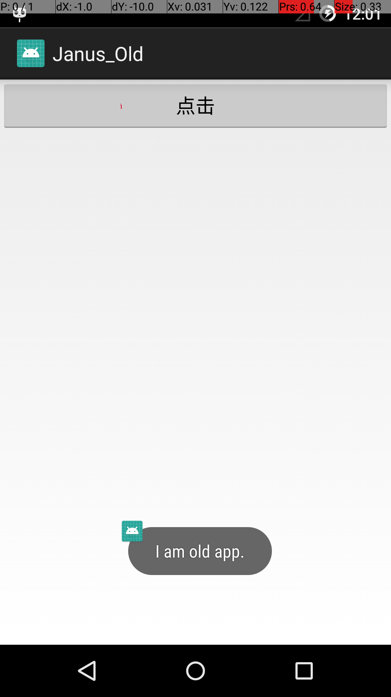
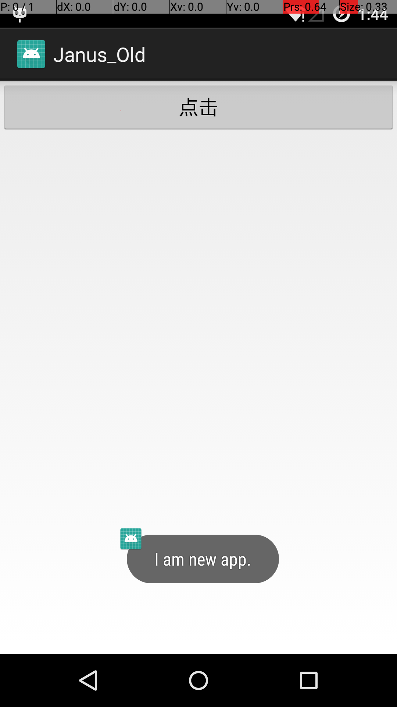

# Janus漏洞模拟测试

## 文件目录介绍

Janus_Old文件夹：原始app的项目工程

janus_old.apk：原始app项目工程打包并用janus_old.keystore签名的apk文件。

classes.dex：破解者修改过的dex文件（这里为了简单其实是直接修改Janus_Old工程逻辑打包并解压得到的dex文件）

janus.py：合并最终apk的脚本

## 测试流程

1. 安装janus_old.apk，点击按钮，Toast打印“I am old app.”，如下图

	
	
2. 用janus.py脚本合并出最终apk，命令如下：

	```
	python janus.py classes.dex janus_old.apk janus_final.apk
	```	
	
3. 覆盖安装并打开janus_final.apk，点击按钮，截图如下：

	
	
>> 测试机型：nexus5，android版本：5.1.1